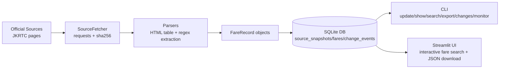
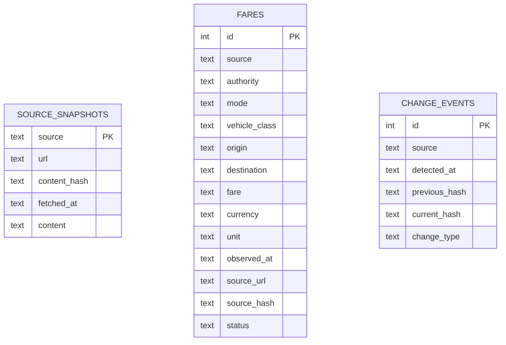
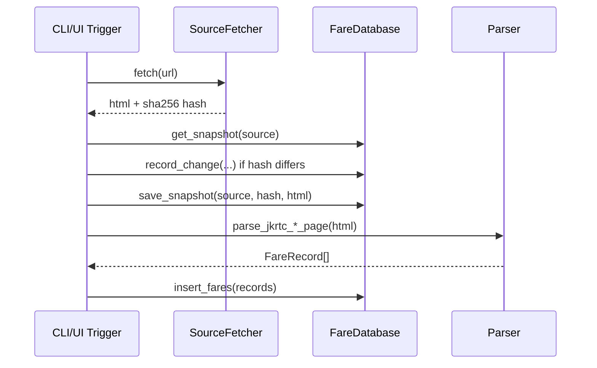

# JK Fare Tracker

A Python-based fare intelligence project for Jammu & Kashmir public transport that:
- fetches fare-related content from official JKRTC web pages,
- normalizes and stores fare observations in SQLite,
- tracks source-page changes with hashes,
- seeds known government reference fares,
- exposes both a CLI and a Streamlit UI for search and export.

---

## 1) System Overview



### Core modules
- `/home/runner/work/JK-Fare-Tracker/JK-Fare-Tracker/jk_fare_tracker.py`
  - domain model (`FareRecord`)
  - persistence (`FareDatabase`)
  - source fetch + hash tracking (`SourceFetcher`)
  - parsers for JKRTC pages
  - CLI commands
- `/home/runner/work/JK-Fare-Tracker/JK-Fare-Tracker/app.py`
  - Streamlit web app for searching and exporting active fares

---

## 2) Repository Layout

```text
/home/runner/work/JK-Fare-Tracker/JK-Fare-Tracker
├── app.py                 # Streamlit interface
├── jk_fare_tracker.py     # CLI + scraping/parsing + DB logic
├── fares.json             # Example/exported fare payload
├── requirements.txt       # Python dependencies
└── README.md
```

---

## 3) Data Sources

Configured in `OFFICIAL_SOURCES`:
- `https://jksrtc.co.in/passenger.php`
- `https://jksrtc.co.in/timetablejammu.php`
- `https://jksrtc.co.in/`

Reference government fare values are seeded from constants in `GOVERNMENT_REFERENCE` (Transport Department context and 2026 references).

---

## 4) Data Model

### FareRecord fields
Each fare record includes:
- `source`, `authority`
- `mode`, `vehicle_class`
- `origin`, `destination`
- `fare` (Decimal, persisted as text)
- `currency`, `unit`
- `observed_at`
- `source_url`, `source_hash`
- `status` (default: `ACTIVE`)

### SQLite schema



Indexes:
- `idx_fares_route (origin, destination)`
- `idx_fares_mode (mode)`
- `idx_fares_observed (observed_at)`

---

## 5) Ingestion + Change Tracking Pipeline



Change types:
- `INITIAL` (first time source seen)
- `SOURCE_CHANGED` (hash changed)
- `UNCHANGED` (no change, event not recorded)

---

## 6) Parsing Strategy

### `parse_jkrtc_passenger_page(...)`
- scans all HTML tables,
- detects route tables via `from`/`to` headers,
- converts non-route columns into fare classes,
- normalizes route names and currency strings,
- emits deduplicated fare records.

### `parse_jkrtc_timetable_page(...)`
- extracts page text,
- applies regex patterns for known seat classes (AC/non-AC),
- emits deduplicated fare records.

### Utility normalization
- `normalize_space`: canonical whitespace
- `clean_money`: extracts numeric fare into `Decimal`
- `normalize_route`: title-cased route labels
- `deduplicate_records`: keyed de-dup across source/mode/class/route/fare/unit

---

## 7) Installation

### Prerequisites
- Python 3.10+
- Internet access to JKRTC endpoints

### Setup

```bash
cd /home/runner/work/JK-Fare-Tracker/JK-Fare-Tracker
python -m venv .venv
source .venv/bin/activate
pip install -r requirements.txt
```

Dependencies:
- `requests`
- `beautifulsoup4`
- `streamlit`

---

## 8) CLI Usage

Main entry point:

```bash
python /home/runner/work/JK-Fare-Tracker/JK-Fare-Tracker/jk_fare_tracker.py <command>
```

### Commands

| Command | Purpose |
|---|---|
| `update` | Fetch official sources, detect changes, parse, store fares |
| `seed-government` | Insert government reference fares |
| `show` | Print active fare records |
| `changes` | Show source change history |
| `export <path>` | Export active fares as JSON |
| `search --from X --to Y --mode Z` | Filter active fares |
| `monitor --interval 3600` | Continuous polling loop |

### Examples

```bash
python jk_fare_tracker.py update
python jk_fare_tracker.py seed-government
python jk_fare_tracker.py show
python jk_fare_tracker.py changes
python jk_fare_tracker.py search --from Jammu --to Srinagar --mode bus
python jk_fare_tracker.py export fares.json
python jk_fare_tracker.py monitor --interval 1800
```

---

## 9) Streamlit UI

Run:

```bash
streamlit run /home/runner/work/JK-Fare-Tracker/JK-Fare-Tracker/app.py
```

UI capabilities:
- update fares from official sources,
- seed government reference fares,
- filter by origin/destination/mode,
- display active records in a table,
- download filtered result as JSON.

---

## 10) Output JSON Format

Typical export structure:

```json
{
  "application": "jk-fare-tracker",
  "generated_at": "ISO-8601 UTC",
  "jurisdiction": "Jammu and Kashmir, India",
  "fares": [
    {
      "source": "JKRTC",
      "authority": "Jammu & Kashmir Road Transport Corporation",
      "mode": "bus",
      "vehicle_class": "19-seater AC",
      "origin": "Jammu",
      "destination": "Srinagar",
      "fare": "...",
      "currency": "INR",
      "unit": "per passenger",
      "observed_at": "ISO-8601 UTC",
      "source_url": "...",
      "source_hash": "sha256...",
      "status": "ACTIVE"
    }
  ]
}
```

---

## 11) Operational Notes

- Database file defaults to `jk_fares.sqlite3` in current working directory.
- `fare` is stored as text to preserve decimal formatting from `Decimal`.
- `update` currently appends fare rows; historical cleanup/versioning can be layered later.
- `monitor` is an infinite loop until interrupted (`Ctrl+C`).

---

## 12) Legal and Data Responsibility

- Validate scraped/public fare data against latest official notifications before operational use.
- This project is an information and monitoring utility, not an official fare publication endpoint.

---

## 13) Quick Start

```bash
cd /home/runner/work/JK-Fare-Tracker/JK-Fare-Tracker
python -m venv .venv
source .venv/bin/activate
pip install -r requirements.txt
python jk_fare_tracker.py update
python jk_fare_tracker.py seed-government
streamlit run app.py
```
